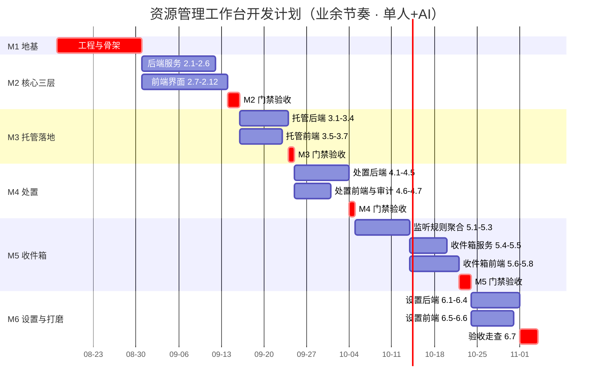

# 资源管理工作台 · 开发计划与任务拆分

| 版本 | 日期 | 说明 |
| --- | --- | --- |
| v0.1 | 2026-08-15 | 第一版，基于《概要设计说明书 v0.1》《详细设计说明书 v0.1》 |

---

## 1. 计划前提与约束

| 项 | 结论 | 对计划的影响 |
| --- | --- | --- |
| 开发模式 | **单人 + AI 辅助开发** | 无传统前后端分工；瓶颈是"单人验收带宽"而非代码产出速度 |
| 并行策略 | **阶段内允许 AI 并行生成，阶段间设硬性验收门禁** | 每个里程碑结束必须人工验收通过才能进下一阶段，避免 AI 并行产出的代码在最后集中爆雷 |
| 投入节奏 | 业余/兼职 | 按**每周约 12~16 小时**有效投入估算；工期以"周"为单位，不精确到人/天 |
| 工期置信度 | 业余节奏受主业波动影响大 | 里程碑给"目标周"和"弹性缓冲"，不承诺日历日期 |
| 验收方式 | 每个里程碑有明确"可演示成果" | 你（产品 + 唯一验收人）能跑起来、点得动，才算完成 |

**为什么不按"人/天"拆**：业余节奏下"人/天"是伪精确。本计划用"任务点 + 预估小时数 + 目标周"三件套，既给 AI 派活有明确边界，也给自己留了缓冲。

---

## 2. 里程碑总览

以**可演示的最小闭环**为导向切分，共 6 个里程碑。M1 必须先完成（地基），M2 起阶段内允许 AI 并行。

| 里程碑 | 可演示成果（验收标准） | 目标周 | 预估投入 | 缓冲 |
| --- | --- | --- | --- | --- |
| **M1 地基与骨架** | Tauri 工程能启动；SQLite 迁移跑通；前后端能通过一条命令通信；空界面带左侧导航占位 | W1-W2 | 20h | +1 周 |
| **M2 核心三层 CRUD** | 能创建/编辑/归档空间、资源集、仅关联引用；资源集详情按类型分组展示；能筛选 | W3-W5 | 40h | +1 周 |
| **M3 托管与落地** | 首次启动初始化资源根目录；"导入并托管"两阶段确认跑通，文件落进 6 类目录 | W6-W7 | 28h | +0.5 周 |
| **M4 处置三档** | 归档/回收站删除/销毁三个动作完整可用，销毁需输入全名二次确认，审计可查 | W8-W9 | 26h | +0.5 周 |
| **M5 收件箱** | 添加监控目录后新建文件能进收件箱；聚合通知、去重、四类处理可用 | W10-W12 | 36h | +1 周 |
| **M6 设置中心与打磨** | 四类设置 UI 完整；根目录迁移三选一可用；默认程序打开生效；整体走查通过 | W13-W14 | 26h | +1 周 |

**总计**：约 176 小时有效投入，日历周期约 **14 周目标 + 最多 4.5 周缓冲 ≈ 4~5 个月**（业余节奏）。

---

## 3. WBS 任务拆分

### 拆分原则

- 每个任务点对应一份可独立派给 AI 的"任务包"（需求出处 + 设计依据 + 验收点）。
- 任务粒度控制在 **2~8 小时**，过小管理成本高、过大 AI 容易跑偏。
- 标注 **可并行** 的任务：阶段内可同时让 AI 开工（通常前端界面与后端服务分离时）；标注 **串行** 的必须等前置完成。

### M1 地基与骨架（W1-W2，20h）

| # | 任务 | 类型 | 预估 | 依赖 | 验收点 |
| --- | --- | --- | --- | --- | --- |
| 1.1 | Tauri 工程脚手架（React+TS 前端、Rust 后端、构建脚本） | 基建 | 4h | — | `pnpm tauri dev` 能起空窗口 |
| 1.2 | SQLite 接入 + sqlx 迁移框架 + `0001_init.sql` 全表 | 后端 | 6h | 1.1 | 启动自动建 10 张表 |
| 1.3 | Tauri Command 通信约定 + 统一错误模型封装 | 后端 | 4h | 1.1 | 前端能调通一个 ping 命令并拿到统一错误结构 |
| 1.4 | 前端应用骨架（路由、左侧导航、空页面占位、主题） | 前端 | 4h | 1.1 | 能切换 4 个空页面 |
| 1.5 | 本地结构化日志 + 开发调试面板 | 基建 | 2h | 1.2 | 关键操作有日志可查 |

**M1 门禁**：工程能从零克隆、按 README 一键跑起来；否则不进 M2。

### M2 核心三层 CRUD（W3-W5，40h）

> 阶段内**前后端可并行**：后端服务（2.1~2.6）与前端界面（2.7~2.12）可同时派给 AI，约定以 §2 接口契约为界。

| # | 任务 | 类型 | 预估 | 依赖 | 验收点 |
| --- | --- | --- | --- | --- | --- |
| 2.1 | 空间服务：5 个命令 + 预置工作/生活空间 | 后端 | 4h | M1 | 单测覆盖 + 命令可调 |
| 2.2 | 资源集服务：5 个命令 + 按类型聚合详情查询 | 后端 | 5h | 2.1 | `collection_get` 返回分组结构 |
| 2.3 | 引用服务：`ref_create_external` / `ref_update` / `ref_get` / `ref_list` | 后端 | 6h | 2.2 | 仅关联创建绝不触碰文件（有测试断言） |
| 2.4 | 标签子系统（双 tag 表 + 查询） | 后端 | 3h | 2.3 | 标签增删与按标签筛选 |
| 2.5 | `query_refs` / `query_facets` 筛选服务 | 后端 | 5h | 2.3 | 多维筛选 + 分页正确 |
| 2.6 | `ref_check_health` / `ref_open` / `ref_reveal_in_finder` | 后端 | 4h | 2.3 | 失效检测返回正确健康度 |
| 2.7 | 前端：空间列表 + 空间创建/编辑对话框 | 前端 | 3h | M1 | 可建/改/归档空间 |
| 2.8 | 前端：资源集列表 + 创建/编辑 | 前端 | 4h | 2.7 | 可在空间下建资源集 |
| 2.9 | 前端：资源集详情页（按类型分组展示引用） | 前端 | 5h | 2.8 | 分组展示与 `collection_get` 对齐 |
| 2.10 | 前端：仅关联创建引用流程（选目录/文件 → 选类型 → 填属性） | 前端 | 5h | 2.9 | 全程走完不改动原文件 |
| 2.11 | 前端：引用编辑、标签、生命周期、保密级别控件 | 前端 | 3h | 2.10 | 属性可改且持久化 |
| 2.12 | 前端：筛选侧边栏 + 列表页 | 前端 | 4h | 2.9 | 筛选与 `query_refs` 结果一致 |

**M2 门禁**：手动走通需求 §7.1"新建工作项目"全流程（建空间→建资源集→关联代码库/文档/制品→按类型查看）。

### M3 托管与落地（W6-W7，28h）

| # | 任务 | 类型 | 预估 | 依赖 | 验收点 |
| --- | --- | --- | --- | --- | --- |
| 3.1 | 落地路径计算领域逻辑（类型→子目录、冲突建议） | 后端 | 4h | M2 | 纯函数单测覆盖 |
| 3.2 | `ref_create_managed` 两阶段（plan / confirmed）+ 复制移动执行 | 后端 | 7h | 3.1 | 失败补偿删除、事务落库 |
| 3.3 | 大文件复制进度事件 | 后端 | 3h | 3.2 | 前端能收到进度回调 |
| 3.4 | 首次启动资源根目录初始化向导（`settings_init_root_dir`） | 后端 | 4h | M2 | 建出 6 个子目录 |
| 3.5 | 前端：初始化向导界面 | 前端 | 3h | 3.4 | 首启强制走初始化 |
| 3.6 | 前端：导入并托管确认框（源→目标对比、冲突提示、copy/move 选择） | 前端 | 5h | 3.2 | 两阶段确认完整 |
| 3.7 | 前端：进度条与结果反馈 | 前端 | 2h | 3.6 | 大文件有进度 |

**M3 门禁**：从收件箱外部场景完整走一遍"导入并托管"，确认文件落进 `Code/Documents/...` 对应目录且原文件按 copy/move 正确处理。

### M4 处置三档（W8-W9，26h）

| # | 任务 | 类型 | 预估 | 依赖 | 验收点 |
| --- | --- | --- | --- | --- | --- |
| 4.1 | 处置能力声明（`caps_json` + `disp_get_capabilities`） | 后端 | 3h | M3 | 能力正确返回 |
| 4.2 | `disp_archive` / `disp_unarchive` | 后端 | 2h | 4.1 | 仅改 disposition 不动文件 |
| 4.3 | `disp_preview`（目录递归统计、可取消） | 后端 | 4h | 4.1 | 大目录统计可取消 |
| 4.4 | `disp_soft_delete`（trash crate 接入） | 后端 | 4h | 4.3 | 文件进系统回收站 |
| 4.5 | `disp_destroy`（输入全名校验）+ 审计写入 + 引用删除 | 后端 | 5h | 4.3 | 销毁后审计仍在、引用已删 |
| 4.6 | `disp_audit_list` + 审计查看界面 | 全栈 | 4h | 4.5 | 可查任意资源的处置历史 |
| 4.7 | 前端：三档操作按钮 + 确认对话框（销毁输入全名） | 前端 | 4h | 4.5 | 三档视觉与确认等级区分清晰 |

**M4 门禁**：对同一份资源分别走归档→恢复→删除→（回收站还原）→销毁，每步文件与数据状态符合 §6.7。

### M5 收件箱（W10-W12，36h）

| # | 任务 | 类型 | 预估 | 依赖 | 验收点 |
| --- | --- | --- | --- | --- | --- |
| 5.1 | 目录监听组件（notify 接入 + 事件标准化） | 后端 | 6h | M4 | 监听目录新建文件能收到事件 |
| 5.2 | 忽略规则引擎（默认规则 + 用户规则匹配） | 后端 | 4h | 5.1 | 隐藏/临时/构建文件被丢弃 |
| 5.3 | 聚合窗口缓冲 + 去重（路径查重、已有关联查重） | 后端 | 5h | 5.2 | 短时间多事件合并为一条 |
| 5.4 | 收件箱服务：7 个命令 | 后端 | 6h | 5.3 | `inbox_assign` 四种模式可用 |
| 5.5 | 敏感文件识别与预览保护 | 后端 | 3h | 5.4 | `.env` 等只显示文件名+风险提示 |
| 5.6 | 前端：收件箱列表 + 条目详情 | 前端 | 5h | 5.4 | 可查看/暂后/忽略 |
| 5.7 | 前端：处理对话框（选空间/资源集/类型 + 仅关联或托管） | 前端 | 5h | 5.6 | 处理完转正式引用 |
| 5.8 | 前端：合并通知与角标 | 前端 | 2h | 5.6 | 多条事件只提示一次 |

**M5 门禁**：添加一个监控目录 → 拖入若干文件（含敏感文件与构建产物）→ 收件箱正确聚合、过滤、提示 → 逐条处理为正式引用。

### M6 设置中心与打磨（W13-W14，26h）

| # | 任务 | 类型 | 预估 | 依赖 | 验收点 |
| --- | --- | --- | --- | --- | --- |
| 6.1 | 根目录迁移：`settings_change_root_dir` 两阶段 + MigrationPlan/Result | 后端 | 6h | M5 | 三选一可用，部分失败正确回滚 |
| 6.2 | 迁移模式互斥锁（迁移期间禁止托管与处置） | 后端 | 2h | 6.1 | 迁移中相关命令返回冲突 |
| 6.3 | 监控目录管理命令 + 增量订阅 | 后端 | 3h | M5 | 增删即时生效 |
| 6.4 | 默认查看程序设置 + `ref_open` 策略生效 | 后端 | 2h | M5 | 按类型用不同程序打开 |
| 6.5 | 前端：设置中心四分区界面 | 前端 | 6h | 6.1 | 四类设置完整可用 |
| 6.6 | 前端：迁移确认向导（影响列表 + 逐项确认） | 前端 | 4h | 6.5 | 迁移影响清晰展示 |
| 6.7 | 整体走查 + 需求 §10 验收标准逐条过 | 测试 | 3h | 全部 | 每条验收项有明确通过证据 |

**M6 门禁（发布门槛）**：需求 §10 全部 17 条验收标准逐条通过。

---

## 4. 甘特图

> 业余节奏、按周。`crit` 为关键路径；非关键任务允许在阶段内前后浮动。

---

## 5. 风险管理

| 风险 | 等级 | 触发条件 | 应对 |
| --- | --- | --- | --- |
| 业余时间被主业挤占 | 高 | 连续两周无实质进展 | 启动缓冲周；仍不够则砍 M6 中非关键打磨项，保核心闭环 |
| AI 并行产出在最后联调爆雷 | 高 | 阶段门禁验收时发现前后端契约不一致 | 以《详细设计》§2 为唯一契约源；阶段内每天让 AI 跑通一次契约冒烟 |
| Tauri / Rust 生态不熟导致 M1 超期 | 中 | M1 超过 3 周 | 降级方案：M1 改用 Electron 脚手架先跑通业务，M6 再评估是否回迁 |
| 跨平台回收站行为差异 | 中 | Linux 无回收站环境 | 按 §5.1 降级策略；第一阶段只承诺 macOS/Windows 完整支持 |
| 目录监听洪峰拖垮 UI | 中 | 解压/构建场景实测卡顿 | 调整聚合窗口与过滤规则参数；必要时限制单目录事件速率 |
| 范围蔓延（想加智能检索/Git 集成） | 中 | 开发中产生新想法 | 一律记入"第二阶段"，本计划不变更 |

---

## 6. 任务管理落地建议

不依赖 JIRA/TAPD，用轻量方式管理，贴合单人 + AI：

1. **任务清单载体**：仓库根目录放 `TASKS.md`，按里程碑分节，每条任务一行（编号、标题、预估、状态 ☐/☑、验收点）。AI 每完成一个任务就更新状态。
2. **派活单元**：每个任务点配一段可直接喂给 AI 的"任务包"——含需求出处（§x.x）、设计依据（详细设计 §x）、验收点。这就是你的"TAPD 工单"。
3. **进度追踪**：每周结束在 `TASKS.md` 顶部记一行"当前里程碑 / 已完成任务数 / 阻塞项"。
4. **变更控制**：任何新想法先写进 `BACKLOG-第二阶段.md`，不进当前计划。

---

## 7. 与既有文档的关系

| 文档 | 作用 | 本计划的使用方式 |
| --- | --- | --- |
| 需求说明书 | 验收标准来源（§10） | M6 门禁逐条对照 |
| 概要设计说明书 | 架构与模块边界（§3/§4） | 任务拆分的模块归属依据 |
| 详细设计说明书 | 接口契约与数据库（§2/§3） | 前后端并行的唯一契约源；AI 派活的技术依据 |

三份设计文档 + 本计划构成第一阶段完整交付物。开发开始后，设计文档原则上冻结，变更走 §6.4 的 BACKLOG。
