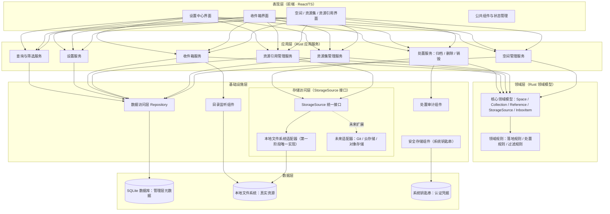
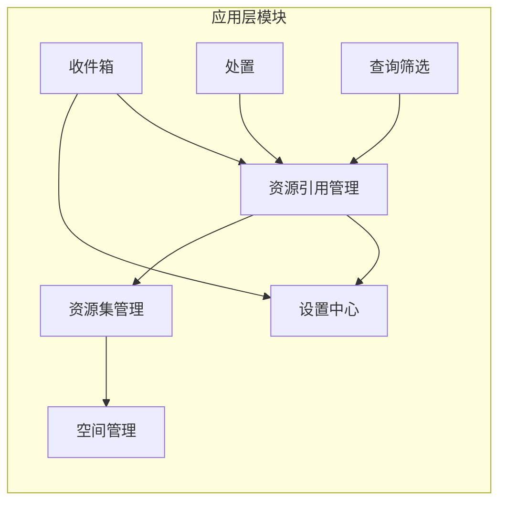
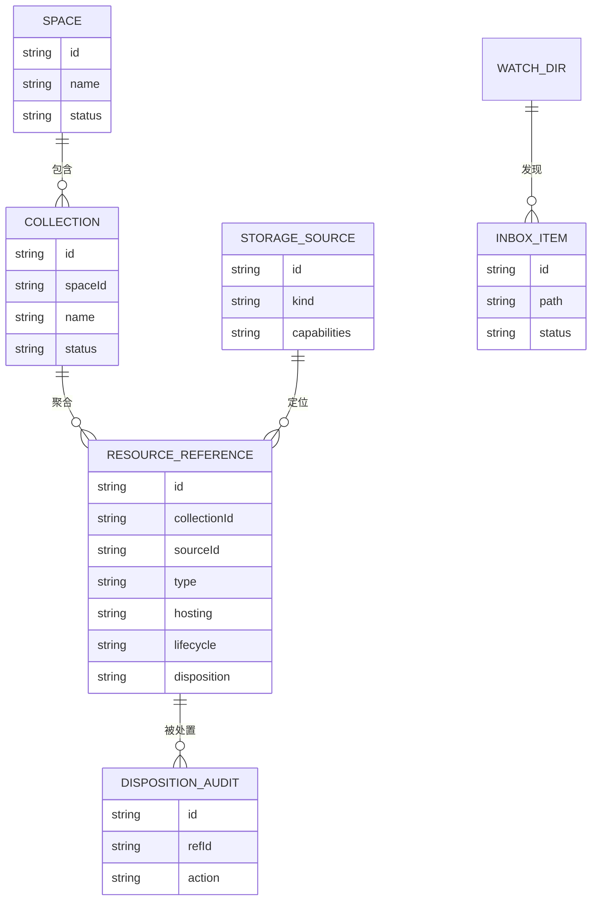
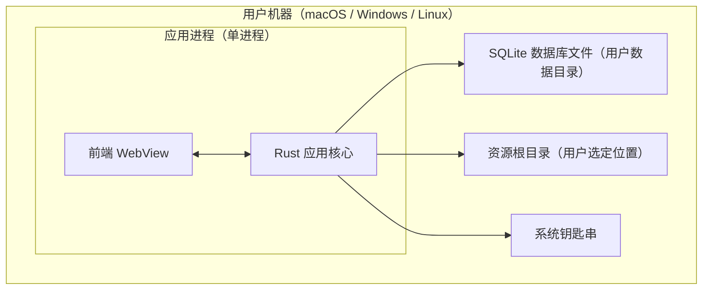

# 资源管理工作台 · 概要设计说明书

| 版本 | 日期 | 说明 |
| --- | --- | --- |
| v0.1 | 2026-08-15 | 第一版，对应《资源管理工作台需求说明书（第一版）》 |

---

## 1. 概述

### 1.1 设计目标

本说明书将需求说明书转化为系统骨架，回答四个问题：

1. **技术选型**：用什么语言、框架、数据库。
2. **系统分层**：表现层、业务逻辑层、数据层如何划分。
3. **模块划分**：系统由哪些模块组成，模块间通过什么接口协作。
4. **部署架构**：系统以什么形态交付和运行。

本文不涉及详细表结构、函数签名、界面交互稿，这些属于详细设计阶段。

### 1.2 设计约束（源自需求 §9）

| 约束 | 对架构的影响 |
| --- | --- |
| 本地优先，数据保存在本机 | 无中心服务器；数据库为嵌入式；无网络依赖 |
| 原始资源优先，不擅自移动/复制文件 | 存储访问必须是可审计的独立层，写操作集中收口 |
| 存储源可演进（Git、云盘、对象存储） | 存储访问层必须接口化，上层模型与具体存储解耦 |
| 归档/删除/销毁是三个独立动作 | 处置操作需要独立的控制模块，强制能力与确认检查 |
| 显式授权，不扫描整台电脑 | 监控与检索以"用户授权清单"为边界，架构上默认拒绝 |
| 系统托管资源脱离工作台仍可寻址 | 落地目录约定是架构级契约，不是某个模块的内部实现 |

---

## 2. 技术选型

| 层次 | 选型 | 备选 | 选择理由 |
| --- | --- | --- | --- |
| 应用形态 | **桌面应用（Tauri）** | Electron、纯 Web + 本地代理 | 需求强依赖桌面能力：系统回收站、目录监听、调用本地默认程序、系统安全存储。Tauri 体积小、单二进制分发，贴合"个人本地工具"定位 |
| 前端 | **React + TypeScript** | Solid、Vue | 生态成熟，团队招聘与维护成本低；Tauri 官方支持良好 |
| 后端（应用核心） | **Rust** | Node.js | Tauri 原生语言；文件系统操作、目录监听（notify）、回收站（trash）均有成熟库；内存安全适合长期驻留的本地服务 |
| 数据库 | **SQLite（嵌入式）** | 文件 JSON、LevelDB | 管理层元数据是典型关系模型（空间-资源集-引用）；SQLite 零运维、事务可靠、单文件便于备份迁移 |
| 目录监听 | Rust `notify` 库 | 自研轮询 | 跨平台封装了 FSEvents / ReadDirectoryChanges / inotify |
| 安全存储 | 操作系统钥匙串（keychain / Credential Manager / Secret Service） | 加密文件 | 需求 §8 要求认证信息不入库；系统钥匙串是各平台标准做法 |
| 进程内通信 | Tauri Command（前端 ↔ Rust 的 RPC） | HTTP localhost | Tauri 内置机制，类型安全、无端口管理负担 |

**选型决策记录**：

- **不选纯 Web**：浏览器无法可靠执行回收站删除、目录监听、调用本地程序，违背需求 §6.4 / §6.7。
- **不选 Electron**：功能上等价，但分发体积与内存占用高；本产品是常驻个人工具，资源占用敏感。
- **不引入独立数据库进程**：第一阶段单机单用户，嵌入式 SQLite 足够；架构上不绑定 SQLite SQL 方言，保留未来替换空间。

---

## 3. 系统总体架构

### 3.1 总体架构图



### 3.2 系统分层说明

| 层 | 职责 | 不做什么 |
| --- | --- | --- |
| **表现层** | 界面渲染、用户交互、本地 UI 状态；通过应用层暴露的命令接口访问数据 | 不直接访问数据库；不直接触碰文件系统 |
| **应用层** | 按业务能力组织的服务集合；编排领域对象与基础设施；定义事务边界 | 不承载业务规则本体（规则在领域层） |
| **领域层** | 核心概念模型与业务规则：落地规则、处置三档规则、收件箱过滤与去重规则 | 不关心数据如何持久化、文件如何读写 |
| **基础设施层** | 与外部世界交互：数据库、文件系统、目录监听、系统钥匙串；存储访问层在此定义统一接口 | 不含业务语义，只提供能力 |
| **数据层** | SQLite（元数据）、本地文件系统（真实资源）、系统钥匙串（凭据） | — |

**关键分层原则**：

1. **表现层与存储完全隔离**。前端永远通过应用层命令访问功能，保证所有写操作都可经处置服务与审计组件收口。
2. **领域层无外部依赖**。落地规则（§6.0）、处置规则（§6.7）、收件箱规则（§6.9）是纯逻辑，可脱离数据库与文件系统独立测试。
3. **存储访问层是唯一允许触碰真实资源的通道**。任何模块要读、复制、移动、删除文件，必须经 `StorageSource` 接口，由适配器声明能力并执行。

---

## 4. 模块划分与接口

### 4.1 模块清单



| 模块 | 职责 | 对应需求 |
| --- | --- | --- |
| **空间管理** | 空间的创建、编辑、归档；预置工作/生活空间 | §6.1 |
| **资源集管理** | 空间下资源集的创建、编辑、归档；按类型聚合的详情视图数据 | §6.2 |
| **资源引用管理** | 引用的创建（仅关联 / 导入并托管）、编辑、失效检测；维护托管方式与定位信息 | §6.0、§6.3 |
| **收件箱** | 承接监听事件、聚合通知、过滤去重、四种处理方式流转 | §6.9 |
| **处置** | 归档 / 删除 / 销毁三档操作的统一入口；能力检查、二次确认、审计记录 | §6.7 |
| **设置中心** | 资源根目录、监控目录、存储源维护、默认查看程序四类设置 | §6.8 |
| **查询筛选** | 按空间、资源集、类型、标签、状态、存储源的元数据筛选 | §6.6 |
### 4.2 基础设施组件

| 组件 | 职责 | 被谁使用 |
| --- | --- | --- |
| **存储访问层（StorageSource 接口）** | 定义读取、创建、复制、移动、可恢复删除、永久销毁、打开 等能力的统一契约；本地文件系统适配器为第一阶段实现 | 资源引用管理、处置、收件箱 |
| **数据访问层（Repository）** | 元数据的持久化与查询，屏蔽 SQL | 全部应用层模块 |
| **目录监听组件** | 订阅监控目录的文件系统事件，输出标准化事件流 | 收件箱 |
| **处置审计组件** | 追加式记录处置时间、操作者、级别、原始定位快照 | 处置 |
| **安全存储组件** | 认证凭据的存取，数据库中只保存引用标识 | 设置中心（存储源维护） |

### 4.3 模块间接口契约

模块间通过**定义良好的服务接口**协作，不共享内部状态。核心接口如下（能力级描述，非函数签名）：

**（1）资源引用管理 → 存储访问层**

| 能力 | 说明 |
| --- | --- |
| 校验定位 | 给定定位信息，检查目标是否存在、是文件还是目录、基础属性 |
| 计算托管目标路径 | 根据资源类型与资源根目录，给出建议落地路径（§6.0 目录约定） |
| 执行托管落地 | 经用户确认后复制或移动源文件到目标路径 |
| 声明处置能力 | 返回该存储源支持的处置操作集合（归档/软删除/销毁/恢复） |

**（2）收件箱 → 目录监听组件**

| 能力 | 说明 |
| --- | --- |
| 订阅 / 退订目录 | 设置中心变更监控目录时增量调整 |
| 事件流 | 标准化事件：路径、事件类型（新建/修改/删除/移动）、时间 |

**（3）收件箱 → 资源引用管理**

| 能力 | 说明 |
| --- | --- |
| 检查路径是否已关联 | 防止重复生成收件箱条目（§6.9 去重规则） |
| 转正式引用 | 用户选择"仅关联"或"导入并托管"后，创建正式资源引用 |

**（4）处置 → 存储访问层 + 审计组件**

| 能力 | 说明 |
| --- | --- |
| 查询处置能力 | 决定界面可显示的操作按钮 |
| 执行软删除 / 销毁 | 本地文件系统：移入回收站 / 永久删除 |
| 写入审计记录 | 任何处置动作执行后追加审计，销毁记录永久保留 |

**（5）全部模块 → 数据访问层**

元数据的 CRUD 与事务，按聚合根划分 Repository（空间、资源集、引用、收件箱条目、设置、审计）。

### 4.4 依赖规则

```text
表现层 ──允许依赖──> 应用层 ──允许依赖──> 领域层 <──允许依赖── 基础设施层（接口）
                                          ▲
                       基础设施层（实现）───┘  依赖倒置：实现依赖接口，领域层不依赖实现
```

- 模块之间只允许沿上图箭头方向依赖，禁止跨层直连（如 UI 直接调 Repository）。
- 存储访问层的接口定义放在领域层边缘，本地文件系统适配器是其一等实现，未来 Git / 云存储适配器以同等地位接入，**上层模块零改动**（§6.5 可演进约束）。

---

## 5. 数据架构（概念模型）

第一阶段的核心实体与关系：



**数据架构决策**：

1. **管理层元数据与真实资源严格分离**：SQLite 只存管理信息；文件内容永不入库（需求 §2 / §9）。
2. **定位信息抽象化**：引用通过"存储源 + 定位信息"寻址真实资源，本地路径只是定位信息的一种形态；这是第二阶段接入 Git / 云存储的扩展点。
3. **处置状态与生命周期分离**：`disposition`（归档/删除/销毁的处置记录）与 `lifecycle`（活跃/已交付等业务状态）正交，避免 §6.7 三档处置与 §6.6 生命周期混淆。
4. **审计数据追加式、永久保留**：销毁后不保留文件内容，但审计元数据不删除（§6.7）。
5. **凭据零入库**：认证信息存系统钥匙串，数据库仅存引用标识（§8）。
6. **第一阶段单归属**：一个资源引用归属一个资源集；多归属留待第二阶段通过关联表扩展，模型上已预留可能。

详细表结构、索引与字段定义在详细设计阶段产出。

---

## 6. 部署架构

### 6.1 部署形态

**单机桌面应用，无服务端，无网络依赖。**



| 决策项 | 结论 | 理由 |
| --- | --- | --- |
| 单体 vs 微服务 | **单体单进程** | 单机单用户本地应用，无任何分布式需求；微服务在此纯属负担 |
| 服务器数量 | **0 台** | 本地优先（§9），第一阶段无同步、无协作 |
| 负载均衡 | **不需要** | 无服务端 |
| 进程模型 | **单进程**：前端 WebView + Rust 核心同进程，通过 Tauri Command 通信 | 无端口、无 IPC 守护进程，安装即用 |
| 数据位置 | SQLite 存于平台标准用户数据目录；资源根目录由用户选定；钥匙串用系统设施 | 备份只需复制数据库文件 + 资源根目录 |
| 分发方式 | 平台安装包（dmg / msi / AppImage），自动更新机制留作后续 | Tauri 官方打包能力 |

### 6.2 演进路径（非第一阶段实现，仅说明架构预留）

- **第二阶段**：新增 Git / 云存储适配器，只增加基础设施层实现，不动分层与部署形态。
- **第三阶段**：如引入智能检索，索引数据同样本地存储（SQLite FTS 或本地向量库），部署形态保持单机。
- **远期如需多设备同步**：SQLite 单文件 + 明确的数据层边界使整体迁移或同步成为可能，但不在本设计承诺范围内。

---

## 7. 关键架构决策汇总（ADR 摘要）

| 编号 | 决策 | 备选 | 决策依据 |
| --- | --- | --- | --- |
| ADR-1 | 桌面应用（Tauri），不做纯 Web | Electron、Web+代理 | 回收站 / 目录监听 / 本地程序调用是硬需求 |
| ADR-2 | 单进程单体 | 前后端分离双进程、微服务 | 单用户本地应用，复杂度收益为负 |
| ADR-3 | SQLite 嵌入式数据库 | JSON 文件、独立数据库进程 | 关系模型 + 事务 + 零运维 |
| ADR-4 | 存储访问层接口化，适配器可插拔 | 直接调用文件系统 API | §6.5 存储源演进是明确需求 |
| ADR-5 | 处置操作集中收口于处置模块 | 各界面自行实现删除逻辑 | §6.7 强制能力检查、二次确认、审计 |
| ADR-6 | 收件箱为独立数据，非引用状态字段 | 在引用表上加状态 | 未授权资源不得污染主数据（§6.9） |
| ADR-7 | 凭据存系统钥匙串，库中仅存引用 | 加密存数据库 | §8 明确要求 |
| ADR-8 | 第一阶段引用单归属资源集 | 多归属关联表 | 降低首版复杂度；§12 待确认项的建议结论 |

---

## 8. 非功能性设计要点

| 维度 | 设计要点 |
| --- | --- |
| **安全** | 默认不监听整台电脑；敏感文件（密钥、凭据）只显示文件名不提取内容；凭据入系统钥匙串；销毁必须二次确认 |
| **可靠性** | 所有多步写操作（如托管落地 + 建引用）在事务或明确补偿机制内完成；监听组件异常退出不影响已落库数据 |
| **可扩展性** | 存储源、资源类型、生命周期、保密级别均为数据驱动或接口扩展，新增不需改架构 |
| **性能** | 元数据量级为个人规模（万级以内），SQLite 无压力；目录监听事件须节流聚合，避免大批量变化拖垮 UI |
| **可测试性** | 领域层纯逻辑无 IO，可单元测试；存储访问层接口化使文件系统可替身 |
| **可审计性** | 处置审计追加式记录；托管落地、根目录迁移等写操作均有用户确认与结果记录 |

---

## 9. 风险与待定项

| 项 | 说明 | 建议 |
| --- | --- | --- |
| 跨平台回收站行为差异 | 各平台回收站语义不一致（如 Linux 部分环境无回收站） | 详细设计阶段逐平台核实；无回收站环境按 §6.7 规则降级为"仅归档或销毁" |
| 大批量文件变化下的监听稳定性 | 解压、构建、同步可能产生洪峰事件 | 聚合窗口 + 过滤规则是架构级要求；详细设计需给具体参数 |
| 资源根目录迁移的冲突处理 | 目标已存在同名文件时策略未定义 | 详细设计阶段定义：跳过 / 重命名 / 覆盖，逐项确认 |
| 引用失效检测的及时性 | 仅启动时检测 vs 实时检测未决 | 第一阶段建议启动时 + 打开时检测，实时检测依赖监控目录覆盖范围 |
| 多资源集归属（§12） | 第一阶段按 ADR-8 单归属实现 | 第二阶段评估，模型已预留 |
| 资源集模板（§12） | 第一阶段不预置模板，自由命名 | 观察真实用法后再定 |
| 文件指纹重定位（§12） | 第一阶段仅路径定位，失效提示人工处理 | 第二阶段评估指纹方案 |

---

## 10. 后续阶段输入

本概要设计完成后，进入详细设计阶段，产出：

1. 数据库详细设计（表结构、索引、迁移脚本）
2. 模块接口详细设计（命令清单、参数与错误模型）
3. 界面信息架构与关键交互稿
4. 存储访问层接口的完整契约（含能力声明与错误语义）
5. 收件箱过滤规则与聚合窗口的具体参数
