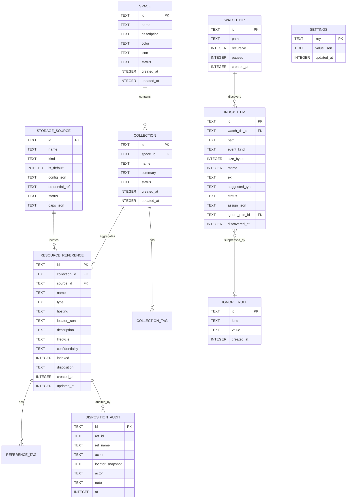
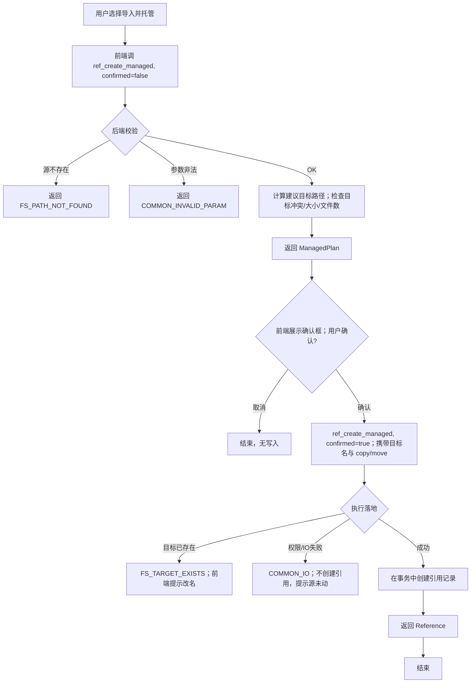
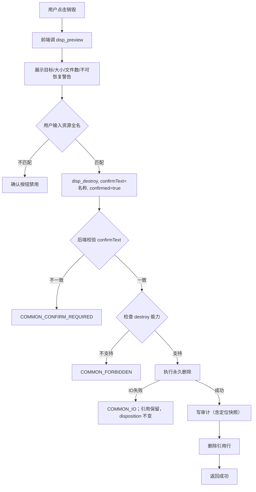
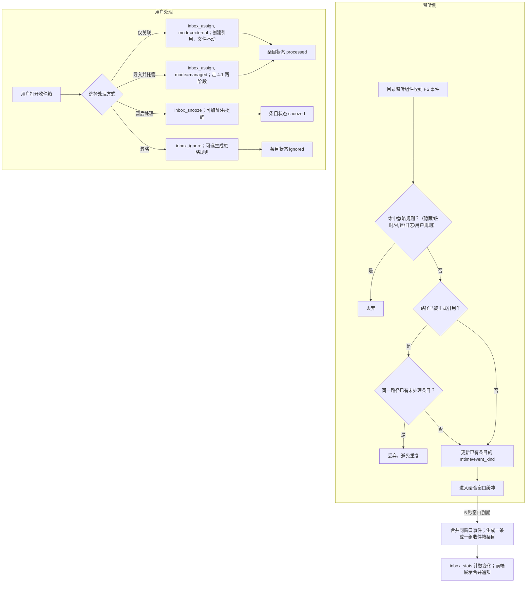
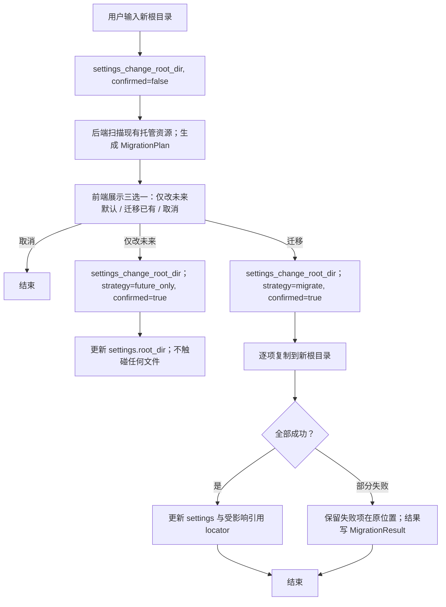

# 资源管理工作台 · 详细设计说明书

| 版本 | 日期 | 说明 |
| --- | --- | --- |
| v0.1 | 2026-08-15 | 第一版，基于《概要设计说明书 v0.1》 |

---

## 1. 文档说明

本文档承接《概要设计说明书》，将架构骨架落地为可编码的详细设计。覆盖：

1. **接口设计**：前端与 Rust 核心之间的命令契约（入参、出参、错误码）。
2. **数据库设计**：表结构、字段类型、索引、主外键、迁移策略。
3. **业务流程**：关键功能的完整流程，含异常分支。
4. **系统对接设计**：本产品无第三方支付/短信类外部服务，对接面为操作系统四项能力：回收站、目录监听、默认程序、系统钥匙串。

**接口形式说明**：应用为 Tauri 单进程桌面应用，前端与 Rust 核心通过 **Tauri Command**（类型安全的进程内 RPC）通信，而非 HTTP API。因此本文的"接口"指 Tauri Command 契约。如未来需提供 HTTP 接口（§11 演进），契约字段保持不变，仅传输层替换。

**约定**：
- 所有 `id` 均为 UUID v4 字符串。
- 时间统一为 ISO 8601 字符串（UTC，如 `2026-08-15T09:30:00Z`）。
- 路径为绝对路径字符串，UI 层与 Rust 层均不做相对路径假设。
- 错误统一返回结构见 §2.2。

---

## 2. 接口设计

### 2.1 接口总览

按模块分组，共 8 组 42 个命令。

| 模块 | 命令前缀 | 数量 |
| --- | --- | --- |
| 空间管理 | `space_*` | 5 |
| 资源集管理 | `collection_*` | 6 |
| 资源引用管理 | `ref_*` | 10 |
| 处置 | `disp_*` | 5 |
| 收件箱 | `inbox_*` | 7 |
| 设置中心 | `settings_*` | 7 |
| 查询筛选 | `query_*` | 2 |
| 系统/通用 | `sys_*` | 2 |

### 2.2 统一错误模型

所有命令失败时返回统一错误结构，前端据此决定提示与降级。

```json
{
  "code": "REF_NOT_FOUND",
  "message": "资源引用不存在或已被销毁",
  "details": { "refId": "..." },
  "retryable": false
}
```

**错误码命名规则**：`{域}_{原因}`，全大写下划线。

| 错误码 | 含义 | 典型触发 |
| --- | --- | --- |
| `COMMON_INVALID_PARAM` | 参数非法（缺字段、格式错误、枚举越界） | 任何命令 |
| `COMMON_NOT_FOUND` | 目标对象不存在 | 按 id 操作 |
| `COMMON_CONFLICT` | 状态冲突（如对已归档对象再次归档） | 状态机操作 |
| `COMMON_FORBIDDEN` | 规则禁止（如对不支持软删除的存储源执行删除） | 处置、设置 |
| `COMMON_IO` | 底层 IO 失败（权限、磁盘满、路径不可达） | 文件类操作 |
| `COMMON_DB` | 数据库错误 | 任何持久化 |
| `COMMON_CONFIRM_REQUIRED` | 需要前端先取得用户确认 | 销毁、托管落地、根目录迁移 |
| `FS_PATH_NOT_FOUND` | 目标路径不存在 | 打开、失效检测 |
| `FS_PERMISSION_DENIED` | 文件系统权限不足 | 读/写/删除 |
| `FS_TARGET_EXISTS` | 托管落地目标已存在同名 | 导入并托管 |
| `FS_RECYCLE_UNSUPPORTED` | 当前平台/存储源不支持回收站 | 删除 |
| `WATCH_INVALID_DIR` | 监控目录非法或不可监听 | 设置中心 |
| `INBOX_STALE` | 收件箱条目对应文件已失效 | 收件箱处理 |
| `CREDENTIAL_STORE` | 钥匙串读写失败 | 存储源凭据 |

### 2.3 空间管理

#### `space_create`
- **入参**：`{ name: string, description?: string, color?: string, icon?: string }`
- **出参**：`Space`
- **错误**：`COMMON_INVALID_PARAM`（名称为空或超长）

#### `space_update`
- **入参**：`{ id, name?, description?, color?, icon? }`
- **出参**：`Space`
- **错误**：`COMMON_NOT_FOUND`、`COMMON_CONFLICT`（已归档空间不可编辑）

#### `space_archive`
- **入参**：`{ id }`
- **出参**：`Space`
- **说明**：逻辑归档，不影响其下资源集与引用（§6.1）
- **错误**：`COMMON_NOT_FOUND`、`COMMON_CONFLICT`（已归档）

#### `space_restore`
- **入参**：`{ id }`
- **出参**：`Space`
- **说明**：从归档恢复

#### `space_list`
- **入参**：`{ status?: "active" | "archived" | "all" }`（默认 active）
- **出参**：`Space[]`

### 2.4 资源集管理

#### `collection_create`
- **入参**：`{ spaceId, name, summary?, tags?: string[] }`
- **出参**：`Collection`
- **错误**：`COMMON_NOT_FOUND`（空间不存在或已归档）

#### `collection_update`
- **入参**：`{ id, name?, summary?, tags? }`
- **出参**：`Collection`

#### `collection_archive` / `collection_restore`
- **入参**：`{ id }`
- **出参**：`Collection`
- **说明**：归档不影响已关联的原始资源（§6.2）

#### `collection_get`
- **入参**：`{ id }`
- **出参**：`CollectionDetail`：
```json
{
  "id": "...", "spaceId": "...", "name": "...", "summary": "...",
  "tags": ["..."], "status": "active", "createdAt": "...",
  "referencesByType": {
    "code":     [ { "ref": {...}, "health": "ok" } ],
    "document": [ ... ],
    "data": [], "artifact": [], "tool": [], "media": []
  }
}
```
其中 `health` 为引用健康度：`ok` / `missing`（路径失效）/ `unknown`（未检测）。

#### `collection_list`
- **入参**：`{ spaceId, status?: "active" | "archived" | "all" }`（默认 active）
- **出参**：`Collection[]`（不含 `referencesByType`，纯列表项）
- **错误**：`COMMON_NOT_FOUND`（空间不存在）
- **说明**：资源集列表页数据源；对齐 `space_list` 的 status 过滤语义

### 2.5 资源引用管理

#### `ref_create_external`（仅关联）
- **入参**：
```json
{
  "collectionId": "...",
  "name": "...",
  "type": "code|document|data|artifact|tool|media",
  "locator": { "kind": "path", "path": "/abs/path" },
  "description?": "...",
  "tags?": ["..."],
  "lifecycle?": "active",
  "confidentiality?": "internal",
  "indexed?": true
}
```
- **出参**：`Reference`
- **关键行为**：只登记，**绝不复制/移动原文件**（§6.3）
- **错误**：`FS_PATH_NOT_FOUND`、`COMMON_INVALID_PARAM`

#### `ref_create_managed`（导入并托管）
- **入参**：同 `ref_create_external`，额外加：
```json
{
  "managedAction": "copy" | "move",
  "targetName?": "自定义目标名（缺省用源名）",
  "confirmed": false
}
```
- **出参**（两阶段）：
  - `confirmed=false`：返回 `ManagedPlan`，**不执行任何写操作**：
    ```json
    {
      "kind": "managed_plan",
      "source": "/abs/source",
      "proposedTarget": "/root/Documents/源名",
      "action": "copy",
      "sizeBytes": 12345,
      "fileCount": 12,
      "conflicts": ["目标已存在同名项"]
    }
    ```
  - `confirmed=true`：执行复制/移动，返回 `Reference`
- **错误**：`FS_TARGET_EXISTS`、`FS_PERMISSION_DENIED`、`COMMON_IO`、`COMMON_CONFIRM_REQUIRED`

#### `ref_update`
- **入参**：`{ id, name?, description?, tags?, lifecycle?, confidentiality?, indexed? }`
- **出参**：`Reference`
- **说明**：只允许改管理属性；`type`、`locator`、`hosting` 不可改（更换需走 `ref_relocate`）

#### `ref_relocate`
- **入参**：`{ id, newLocator: {...} }`
- **出参**：`Reference`
- **触发场景**：用户在系统外移动了文件、迁移到云存储（§7.3）
- **错误**：`FS_PATH_NOT_FOUND`

#### `ref_get` / `ref_list`
- `ref_get { id }` → `Reference`
- `ref_list { collectionId, type?, lifecycle?, disposition? }` → `Reference[]`

#### `ref_check_health`
- **入参**：`{ id }` 或 `{ collectionId }`
- **出参**：`[{ refId, health, detail? }]`
- **说明**：检测定位是否仍有效；不修改数据，仅返回结果供 UI 标记

#### `ref_open`
- **入参**：`{ id, appOverride?: "/Applications/xxx.app" }`
- **出参**：`{ opened: true, strategy: "system_default" | "custom" }`
- **说明**：按设置中心"默认查看程序"打开；`appOverride` 为本次覆盖（§6.8 补充规则）
- **错误**：`FS_PATH_NOT_FOUND`、`FS_PERMISSION_DENIED`

#### `ref_reveal_in_finder`
- **入参**：`{ id }`
- **说明**：在系统文件管理器中显示（macOS Finder / Windows Explorer）

### 2.6 处置（归档 / 删除 / 销毁）

处置命令全部要求显式的处置级别，且写审计。

#### `disp_get_capabilities`
- **入参**：`{ refId }`
- **出参**：
```json
{
  "archive": true,
  "softDelete": true,
  "destroy": true,
  "restoreFromBin": true,
  "reason": { "softDelete": "ok" }
}
```
- **说明**：UI 据此渲染可用按钮；能力为 `false` 时必须给出 `reason`（§6.7）

#### `disp_archive`
- **入参**：`{ refId }`
- **出参**：`Reference`
- **说明**：仅改 `disposition=archived`；**不触碰文件**（§6.7）

#### `disp_unarchive`
- **入参**：`{ refId }`
- **出参**：`Reference`

#### `disp_soft_delete`
- **入参**：`{ refId, confirmed: true }`
- **出参**：`Reference`（`disposition=deleted`）
- **关键行为**：
  1. 检查 `softDelete` 能力，不支持则 `COMMON_FORBIDDEN`
  2. 对目录：先统计文件数与总大小返回给前端展示（前端在确认前调 `disp_preview`）
  3. 执行系统回收站移动
  4. 写审计
- **错误**：`FS_RECYCLE_UNSUPPORTED`、`FS_PERMISSION_DENIED`、`COMMON_IO`

#### `disp_destroy`
- **入参**：`{ refId, confirmText: string, confirmed: true }`
- **关键行为**：
  1. `confirmText` 必须与资源当前名称完全一致，否则 `COMMON_CONFIRM_REQUIRED`
  2. 对目录先统计（前端须先调 `disp_preview` 向用户展示）
  3. 永久删除
  4. 写审计（审计保留，引用行物理删除）
- **错误**：`COMMON_CONFIRM_REQUIRED`、`FS_PERMISSION_DENIED`、`COMMON_IO`

#### `disp_preview`
- **入参**：`{ refId }`
- **出参**：
```json
{
  "target": "/abs/path",
  "isDir": true,
  "fileCount": 1234,
  "totalBytes": 5678901,
  "capability": { ... },
  "warning": "目录包含 1234 个文件；销毁后不可恢复"
}
```
- **说明**：删除/销毁确认框的专用数据接口；**必须**在确认前调用一次

#### `disp_audit_list`
- **入参**：`{ refId?, action?, limit?, offset? }`
- **出参**：`DispositionAudit[]`
- **说明**：审计查询；销毁记录在引用删除后仍可查

### 2.7 收件箱

#### `inbox_list`
- **入参**：`{ status?: "pending"|"snoozed"|"processed"|"ignored"|"stale", limit?, offset? }`
- **出参**：`InboxItem[]`（含建议类型、基础信息、过滤命中原因）
- **说明**：`status` 缺省时排除 `stale`（失效条目默认隐藏，仅显式 `status="stale"` 或批量清理入口触达）

#### `inbox_get`
- **入参**：`{ id }`
- **出参**：`InboxItemDetail`（含可选预览；敏感文件无预览，仅文件名+风险提示，§6.9）

#### `inbox_assign`
- **入参**：
```json
{
  "id": "...",
  "mode": "external" | "managed",
  "spaceId": "...", "collectionId": "...", "type": "...",
  "managedAction?": "copy|move",
  "confirmed": false
}
```
- **出参**：`{ inboxItem: {...}, reference?: Reference, managedPlan?: {...} }`
- **说明**：转正式引用；`managed` 且 `confirmed=false` 时返回 `managedPlan` 走二次确认

#### `inbox_snooze`
- **入参**：`{ id, note?, remindAt? }`
- **出参**：`InboxItem`

#### `inbox_ignore`
- **入参**：`{ id, rule?: { kind: "once"|"by_ext"|"by_name"|"by_dir", value?: string } }`
- **出参**：`InboxItem`
- **说明**：`rule` 非 once 时创建忽略规则，后续同类事件直接静默

#### `inbox_dismiss_stale`
- **入参**：`{ id }`
- **说明**：标记已失效条目为已处理（源文件已不在）

#### `inbox_dismiss_all_stale`
- **入参**：无
- **出参**：`number`（清理条数）
- **说明**：批量把所有 `stale` 条目（改名/删除后源文件已不在，由聚合层自动标记）置为 `processed`

#### `inbox_stats`
- **出参**：`{ pending: 12, snoozed: 3, stale: 1, lastEventAt: "..." }`
- **说明**：用于托盘/侧边栏角标；聚合通知由此驱动；`stale` 计数驱动收件箱「清理已失效」入口

### 2.8 设置中心

#### `settings_get_root_dir` / `settings_init_root_dir`
- `settings_get_root_dir()` → `{ rootDir?: string, initialized: bool }`
- `settings_init_root_dir { rootDir }` → 创建 6 个类型子目录，返回 `{ rootDir, created: [...] }`
- **错误**：`FS_PERMISSION_DENIED`、`COMMON_IO`

#### `settings_change_root_dir`
- **入参**：`{ newRootDir, strategy: "future_only"|"migrate", confirmed: false }`
- **出参**（两阶段）：
  - `confirmed=false`：返回 `MigrationPlan`（待迁移项列表、每项源/目标、冲突、总大小）
  - `confirmed=true` 且 `strategy="migrate"`：逐项执行，返回 `MigrationResult{ migrated: [...], failed: [...] }`
- **关键约束**：绝不静默搬迁（§6.8 补充规则）

#### `settings_list_watch_dirs` / `settings_add_watch_dir` / `settings_remove_watch_dir` / `settings_pause_watch_dir`
- `settings_add_watch_dir { path, recursive: true }`
- **错误**：`WATCH_INVALID_DIR`
- **说明**：增删即时生效，监听组件增量订阅/退订

#### `settings_list_sources` / `settings_update_source`
- 第一阶段只有一条 `LocalFsSource` 记录；`update` 只允许改名称与重检测状态
- 出参包含 `capabilities`，供 UI 展示与处置能力判断

#### `settings_get_default_app` / `settings_set_default_app`
- `settings_set_default_app { type: "document", strategy: "system_default" }`
- 或 `{ type, strategy: "app", appPath: "/Applications/Typora.app" }`

### 2.9 查询筛选

#### `query_refs`
- **入参**（全部可选）：
```json
{
  "spaceId?", "collectionId?", "type?", "tags?": ["..."],
  "lifecycle?", "confidentiality?", "disposition?", "sourceId?",
  "keyword?", "limit?", "offset?"
}
```
- **出参**：`{ total: 123, items: Reference[] }`
- **说明**：第一阶段仅元数据筛选；内容检索为第三阶段

#### `query_facets`
- **入参**：`{ spaceId? }`
- **出参**：各类型的可用筛选值与计数，用于侧边栏

### 2.10 系统 / 通用

#### `sys_get_app_info`
- 出参：版本、数据目录、数据库路径、首次启动标志

#### `sys_open_path_with`
- **入参**：`{ path, appPath? }`
- **说明**：通用"用某程序打开"，供 `ref_open` 与收件箱复用

---

## 3. 数据库设计

### 3.1 ER 图



### 3.2 表结构详表

> 时间字段统一存 INTEGER（Unix 秒），接口层序列化为 ISO 8601。`id` 为 TEXT(UUID)。

#### `space`
| 字段 | 类型 | 约束 | 说明 |
| --- | --- | --- | --- |
| id | TEXT | PK | UUID |
| name | TEXT | NOT NULL, 长度≤64 | |
| description | TEXT | | |
| color | TEXT | | 预设色板值 |
| icon | TEXT | | 预设图标 key |
| status | TEXT | NOT NULL DEFAULT 'active' | `active` / `archived` |
| created_at / updated_at | INTEGER | NOT NULL | |

**索引**：`idx_space_status(status)`

#### `collection`
| 字段 | 类型 | 约束 | 说明 |
| --- | --- | --- | --- |
| id | TEXT | PK | |
| space_id | TEXT | NOT NULL, FK→space(id) ON DELETE RESTRICT | |
| name | TEXT | NOT NULL | |
| summary | TEXT | | |
| status | TEXT | NOT NULL DEFAULT 'active' | `active` / `archived` |
| created_at / updated_at | INTEGER | NOT NULL | |

**索引**：`idx_collection_space(space_id)`、`idx_collection_status(status)`
**外键说明**：RESTRICT——存在资源集时不允许物理删除空间（空间只有归档，无物理删除）

#### `collection_tag`
| 字段 | 类型 | 约束 |
| --- | --- | --- |
| collection_id | TEXT | NOT NULL, FK→collection(id) ON DELETE CASCADE |
| tag | TEXT | NOT NULL |
| PRIMARY KEY | (collection_id, tag) | |

**索引**：`idx_collection_tag_tag(tag)`（供按标签筛选）

#### `resource_reference`
| 字段 | 类型 | 约束 | 说明 |
| --- | --- | --- | --- |
| id | TEXT | PK | |
| collection_id | TEXT | NOT NULL, FK→collection(id) ON DELETE RESTRICT | 第一阶段单归属（ADR-8） |
| source_id | TEXT | NOT NULL, FK→storage_source(id) | |
| name | TEXT | NOT NULL | 显示名，可与文件本名不同 |
| type | TEXT | NOT NULL | `code/document/data/artifact/tool/media` |
| hosting | TEXT | NOT NULL | `external` / `managed` |
| locator_json | TEXT | NOT NULL | JSON，见下 |
| description | TEXT | | |
| lifecycle | TEXT | NOT NULL DEFAULT 'active' | `active/staged/delivered/archived` |
| confidentiality | TEXT | NOT NULL DEFAULT 'internal' | `public/internal/customer_restricted/sensitive` |
| indexed | INTEGER | NOT NULL DEFAULT 1 | 0/1，是否纳入检索 |
| disposition | TEXT | NOT NULL DEFAULT 'none' | `none/archived/deleted`（destroy 后整行删除） |
| created_at / updated_at | INTEGER | NOT NULL | |

**`locator_json` 形态**：
- 本地文件：`{"kind":"path","path":"/abs/path"}`
- Git（预留）：`{"kind":"repo","local":"/abs/path","remote":"https://...","defaultBranch":"main"}`
- 云存储（预留）：`{"kind":"cloud","provider":"...","objectId":"..."}`

**索引**：
- `idx_ref_collection(collection_id)`
- `idx_ref_type(type)`
- `idx_ref_lifecycle(lifecycle)`
- `idx_ref_disposition(disposition)`
- `idx_ref_locator_path((json_extract(locator_json,'$.path')))`（失效检测、收件箱去重）

#### `reference_tag`
同 `collection_tag` 结构，`reference_id` 外键 CASCADE。

#### `storage_source`
| 字段 | 类型 | 说明 |
| --- | --- | --- |
| id | TEXT | PK |
| name | TEXT | NOT NULL |
| kind | TEXT | NOT NULL，`local_fs` / `git` / `cloud` / `object_storage`（第一阶段仅 local_fs） |
| is_default | INTEGER | 第一阶段恒为 1 |
| config_json | TEXT | 非敏感配置（如根路径） |
| credential_ref | TEXT | 钥匙串条目的 key，**不存凭据本体** |
| status | TEXT | `ok/degraded/unavailable` |
| caps_json | TEXT | `{"archive":true,"softDelete":true,"destroy":true,"restoreFromBin":true,"retentionQuery":false}` |

**初始数据**：迁移时插入一条 `kind='local_fs'` 的默认记录。

#### `inbox_item`
| 字段 | 类型 | 说明 |
| --- | --- | --- |
| id | TEXT | PK |
| watch_dir_id | TEXT | FK→watch_dir(id) ON DELETE CASCADE |
| path | TEXT | NOT NULL，绝对路径 |
| event_kind | TEXT | `created/modified/renamed/removed` |
| size_bytes | INTEGER | |
| mtime | INTEGER | |
| ext | TEXT | 小写扩展名，无点 |
| suggested_type | TEXT | 建议类型（可空） |
| status | TEXT | `pending/snoozed/processed/ignored/stale` |
| assign_json | TEXT | 处理结果快照（spaceId/collectionId/type/mode） |
| ignore_rule_id | TEXT | FK→ignore_rule(id)，可空 |
| snooze_note | TEXT | |
| remind_at | INTEGER | 可空 |
| discovered_at | INTEGER | NOT NULL |

**索引**：`idx_inbox_status(status)`、`idx_inbox_path(path)`（去重）、`idx_inbox_watch(watch_dir_id)`

#### `watch_dir`
| 字段 | 类型 | 说明 |
| --- | --- | --- |
| id | TEXT | PK |
| path | TEXT | NOT NULL UNIQUE |
| recursive | INTEGER | NOT NULL DEFAULT 1 |
| paused | INTEGER | NOT NULL DEFAULT 0 |
| created_at | INTEGER | |

#### `ignore_rule`
| 字段 | 类型 | 说明 |
| --- | --- | --- |
| id | TEXT | PK |
| kind | TEXT | `by_ext/by_name/by_dir` |
| value | TEXT | NOT NULL |
| created_at | INTEGER | |

**索引**：`idx_ignore_kind(kind, value)`

#### `disposition_audit`
| 字段 | 类型 | 说明 |
| --- | --- | --- |
| id | TEXT | PK |
| ref_id | TEXT | 引用 id（销毁后引用行删除，此字段保留作审计） |
| ref_name | TEXT | 销毁时的名称快照 |
| action | TEXT | `archive/unarchive/soft_delete/destroy` |
| locator_snapshot | TEXT | 处置时的定位快照 JSON |
| actor | TEXT | 第一阶段固定 `local_user` |
| note | TEXT | |
| at | INTEGER | NOT NULL |

**索引**：`idx_audit_ref(ref_id)`、`idx_audit_at(at)`
**约束**：**无外键**——销毁后引用行已不存在，审计必须独立存活（§6.7）

#### `settings`
| 字段 | 类型 | 说明 |
| --- | --- | --- |
| key | TEXT | PK |
| value_json | TEXT | |
| updated_at | INTEGER | |

**预置 key**：`root_dir`、`default_apps`、`first_launch_done`

### 3.3 迁移策略

- 使用 `sqlx migrate`，启动时自动执行未应用的迁移。
- 数据库文件位置：`~/.workbench/workbench.db`（home 目录下的固定数据目录，便于备份与同步）。历史版本位于 `{平台用户数据目录}/resource-workbench/`，启动时自动迁移，失败则中止启动并提示手动迁移。
- 迁移文件按 `0001_init.sql`、`0002_xxx.sql` 递增，**只增不改**。
- 启动时检查 PRAGMA `user_version` 与迁移表一致性，失败则备份当前 db 文件为 `workbench.db.bak.{timestamp}` 后退出并提示。

---

## 4. 业务流程设计

### 4.1 导入并托管（含确认两阶段）



**异常处理要点**：
- 落地成功但写库失败：补偿删除已落地文件，返回 `COMMON_DB`，保证"要么都成功要么都没有"。
- 大文件复制：后端流式复制并周期发进度事件 `managed_progress{refId, bytes, total}`，前端展示进度条。

### 4.2 销毁流程（三档处置中最严）



### 4.3 收件箱：监听 → 通知 → 处理



**实时性**：聚合窗口有实际写入（created/updated/staled > 0）时，后端 emit `inbox-changed` 事件（载荷为窗口统计），收件箱页监听后静默刷新当前列表（保持选中与页码，免轮询）；侧边栏角标与合并通知仍由 `inbox_stats` 5 秒轮询驱动。

**异常分支**：
- 处理时源文件已不存在 → `inbox_assign` 返回 `INBOX_STALE`，前端引导用户 `inbox_dismiss_stale`。
- 监听目录中文件被改名/删除 → 聚合层自动把旧路径的 pending/snoozed 条目标记为 `stale`（见 §5.2 重命名标准化）；改名后收件箱只保留 1 条待处理，`stale` 条目默认隐藏，可通过收件箱顶部「清理已失效」入口批量 `inbox_dismiss_all_stale`。
- 监听组件崩溃重启：启动时扫描 `watch_dir` 表与 `inbox_item` 最新 `discovered_at`，对错过窗口不补偿（第一阶段策略：宁缺勿滥，避免误报洪峰）。

### 4.4 修改资源根目录（设置中心）



**关键约束**：迁移过程中应用进入"迁移模式"，禁止新的托管落地与处置操作，避免并发写冲突。

---

## 5. 系统对接设计

本产品无第三方支付/短信类外部服务。对接面为操作系统四项能力，全部封装在基础设施层，业务层不直接调用。

### 5.1 系统回收站

| 项 | 内容 |
| --- | --- |
| 用途 | `disp_soft_delete` 的落地执行 |
| 实现 | Rust `trash` crate（跨平台：macOS Trash / Windows Recycle Bin / freedesktop Trash） |
| 适配差异 | Linux 部分环境无回收站 → 启动时探测，能力写入 `storage_source.caps_json.softDelete`；不支持时 UI 隐藏"删除"按钮并按 §6.7 提示只能归档或销毁 |
| 错误映射 | 权限不足 → `FS_PERMISSION_DENIED`；目标过大 → `COMMON_IO`；不支持 → `FS_RECYCLE_UNSUPPORTED` |

### 5.2 目录监听

| 项 | 内容 |
| --- | --- |
| 用途 | 收件箱事件来源 |
| 实现 | Rust `notify` crate（macOS FSEvents / Windows ReadDirectoryChangesW / Linux inotify） |
| 事件标准化 | 平台事件统一映射为 `created/modified/renamed/removed`；重命名按信息量分三路：`RenameMode::Both` → `renamed`（事件携带 from+to，聚合层"改名跟随"：旧条目 path 直接改为新路径，不新建）；`RenameMode::From` 单侧 → `removed`；`RenameMode::To` 单侧 → `created`（macOS FSEvents 常拆分投递，如此改名后只保留 1 条待处理） |
| 节流 | 5 秒聚合窗口 + 同路径去重 + 忽略规则前置过滤 |
| 增量订阅 | `watch_dir_set/unset` 保存/删除配置后即时调用 `add_watch`/`remove_watch`，新增/移除监控目录免重启生效；挂载失败（如 macOS TCC 拦截其他应用容器目录）标记 `paused=1`、配置保留可重试，`watch_dir_get` 出参携带 `paused`，设置中心显示「已暂停」徽标并在添加时给出授权提示 |
| 失效标记 | `removed` / 无目标路径的 `renamed` 事件到达时，若对应 pending/snoozed 条目在磁盘上已不存在 → 自动标记 `status='stale'`（默认从列表隐藏，批量清理见 §2.7 `inbox_dismiss_all_stale`）；无已有条目时不为已消失文件新建待处理 |
| 故障 | 监听器异常退出时记录日志并尝试重启（最多 3 次），仍失败则该目录 `paused=1` 并在设置中心标记 |

### 5.3 默认程序打开

| 项 | 内容 |
| --- | --- |
| 用途 | `ref_open` / `sys_open_path_with` |
| 实现 | Rust `open` crate（调用 `open` / `cmd /c start` / `xdg-open`） |
| 策略 | 用户未配置该类型默认程序 → 系统默认；配置为 `app` → 指定路径 |
| 覆盖 | `ref_open` 的 `appOverride` 仅本次生效，不写设置（§6.8 补充规则） |

### 5.4 系统钥匙串

| 项 | 内容 |
| --- | --- |
| 用途 | 未来存储源凭据（Git token、云存储密钥） |
| 实现 | Rust `keyring` crate（macOS Keychain / Windows Credential Manager / Linux Secret Service） |
| 数据约定 | 数据库 `storage_source.credential_ref` 存 key（如 `src_{id}`），凭据本体只在钥匙串 |
| 第一阶段 | 仅本地文件系统，**不使用**钥匙串；接口与表结构先行预留 |

---

## 6. 非功能性设计细化

| 维度 | 详细设计 |
| --- | --- |
| 性能 | 所有列表接口强制 `limit/offset`；`query_refs` 走索引覆盖；目录递归统计（`disp_preview`）在后台线程执行并支持取消 |
| 并发 | 多步写操作（托管落地、根目录迁移、销毁）通过互斥锁串行化；同一引用同时只允许一个处置操作 |
| 可观测 | 关键操作（托管、迁移、处置、监听异常）写本地结构化日志，滚动保留 7 天 |
| 备份 | 提供 `设置 → 导出元数据`，将 SQLite 文件 + settings 打包导出；导入为后续阶段 |
| 可测试 | 领域规则（落地路径计算、忽略匹配、聚合窗口）为纯函数，单测覆盖；存储访问层接口允许内存替身 |

---

## 7. 接口清单速查

> 完整契约见 §2；本表为前端开发速查。

| 命令 | 简述 |
| --- | --- |
| `space_create/update/archive/restore/list` | 空间 CRUD |
| `collection_create/update/archive/restore/get/list` | 资源集 CRUD + 详情 + 列表 |
| `ref_create_external` | 仅关联创建 |
| `ref_create_managed` | 导入并托管（两阶段） |
| `ref_update/relocate/get/list/check_health/open/reveal_in_finder` | 引用维护 |
| `disp_get_capabilities/preview/archive/unarchive/soft_delete/destroy/audit_list` | 处置 |
| `inbox_list/get/assign/snooze/ignore/dismiss_stale/dismiss_all_stale/stats` | 收件箱 |
| `settings_get_root_dir/init_root_dir/change_root_dir` | 根目录 |
| `settings_list_watch_dirs/add_watch_dir/remove_watch_dir/pause_watch_dir` | 监控目录 |
| `settings_list_sources/update_source` | 存储源 |
| `settings_get_default_app/set_default_app` | 默认程序 |
| `query_refs/query_facets` | 筛选 |
| `sys_get_app_info/sys_open_path_with` | 通用 |

---

## 8. 与需求验收标准对照

| 需求 §10 验收项 | 详细设计落点 |
| --- | --- |
| 创建/自定义空间、资源集、按类型分组 | §2.3、§2.4 `collection_get.referencesByType` |
| 仅关联不改动原文件 | §2.5 `ref_create_external` 明确"绝不复制/移动" |
| 导入并托管落入 6 类固定目录 | §2.5 `ManagedPlan` + §4.1 |
| 设置类型/说明/标签/生命周期/保密级别 | `resource_reference` 字段 + `ref_update` |
| 按类型/状态/标签筛选 | §2.9 `query_refs` |
| 存储源字段 + 本地默认实现 | `storage_source` 表 + 初始数据 |
| 未授权目录不纳入检索 | `indexed` 字段 + 收件箱"显式授权"流转 |
| 归档可恢复且原文件不受影响 | `disp_archive` 仅改 disposition |
| 删除走回收站、销毁二次确认不可恢复 | §2.6、§4.2 |
| 云存储按能力展示处置操作 | `disp_get_capabilities` + `caps_json` |
| 根目录初始化/调整 + 迁移影响说明 | §2.8、§4.4 |
| 监控目录有限范围、不默认监听整台电脑 | `watch_dir` 表 + §5.2 |
| 收件箱合并提醒、四类处理、去重过滤 | §2.7、§4.3、§5.2 |

---

## 9. 后续输入

本文档完成后，下一阶段可直接进入：
1. Rust 工程骨架搭建（模块结构对齐概要设计 §4）
2. 前端信息架构与关键界面原型
3. 单元测试与集成测试计划（重点覆盖 §4 各流程的异常分支）
